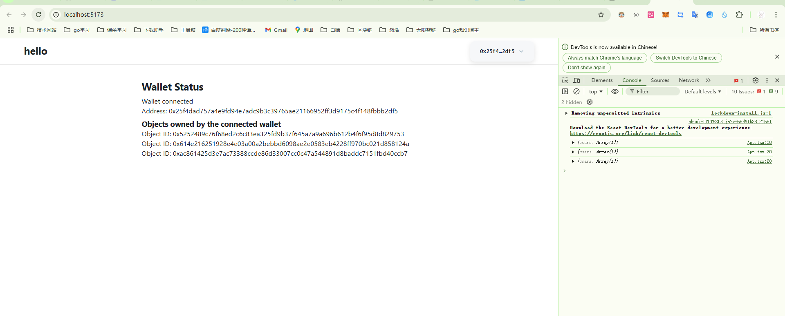
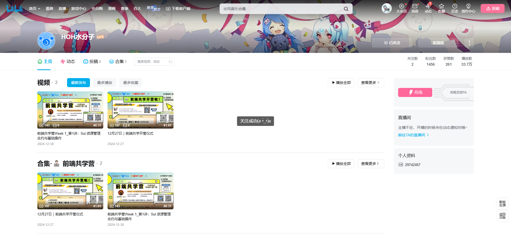
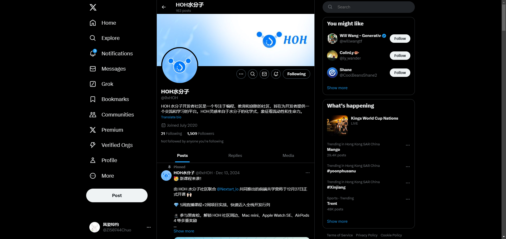
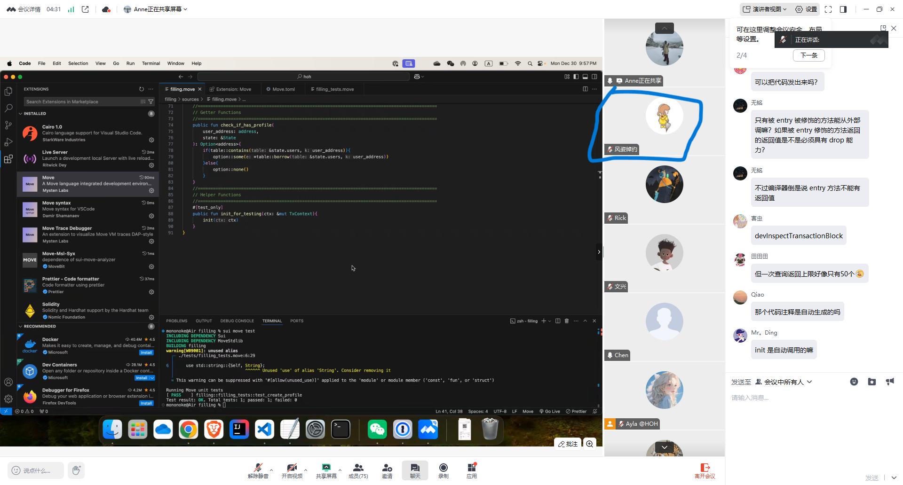
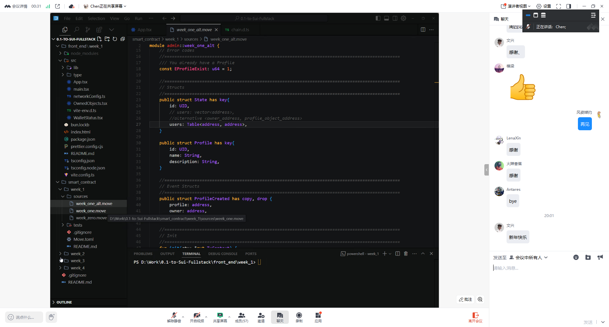

## 个人简介
- 工作经验: 3年
- 技术栈: java、golang、solidity
> 重要提示 请认真写自己的简介
- 从大学开始了解区块链，出来后做golang就是为了有一天我能够成功的进入区块链行业，感觉区块链大势到来，我希望能够通过sui在区块链这个行业有一席之地
- 联系方式: tg: `https://t.me/luckyHucc`

## 作业
- [] 第一周:

- [] 第二周:
- [] 第三周:
- [] 第四周:

## b站，推特关注

- [] b站，推特关注截图: 
b站
推特

## 为共学营宣传（在朋友圈或者群聊中转发海报/文章）

- [] 宣传截图:

## 每周课程学习

- [] 第一周:
  第二次直播课代码复盘study_record.png)
  第三次直播课运行完成

- [] 第二周:

  第二周第一次直播课：

  

  第二周第二次直播课：

  

  第二周第三次直播课

  

  第三次直播课结束：

  

- [] 第三周:

- [] 第四周:

## 参加直播答疑

- [] 第一周:
- [] 第二周:
- [] 第三周:
- [] 第四周:

## 群里分享学习笔记

- [] 第一篇笔记

​	react笔记之jsx:https://blog.csdn.net/qq_43707445/article/details/145009793?sharetype=blogdetail&sharerId=145009793&sharerefer=PC&sharesource=qq_43707445&spm=1011.2480.3001.8118

- [] 第二篇笔记

  react笔记之组件：https://blog.csdn.net/qq_43707445/article/details/145042649?sharetype=blogdetail&sharerId=145042649&sharerefer=PC&sharesource=qq_43707445&spm=1011.2480.3001.8118

- [] 第三篇笔记

  react笔记之组件02：https://blog.csdn.net/qq_43707445/article/details/145065747

- [] 第四篇笔记

## 对外输出学习笔记

- [] 第一篇笔记【学习笔记链接】

  <a href = "https://blog.csdn.net/qq_43707445/article/details/145009793?sharetype=blogdetail&sharerId=145009793&sharerefer=PC&sharesource=qq_43707445&spm=1011.2480.3001.8118">学习笔记之jsx</a>

- [] 第二篇笔记【学习笔记链接】

  <a href = "https://blog.csdn.net/qq_43707445/article/details/145042649?sharetype=blogdetail&sharerId=145042649&sharerefer=PC&sharesource=qq_43707445&spm=1011.2480.3001.8118">学习笔记之组件</a>

- [] 第三篇笔记【学习笔记链接】

  <a href = "https://blog.csdn.net/qq_43707445/article/details/145065747">学习笔记之组件02</a>

- [] 第四篇笔记【学习笔记链接】

## 在HOH社区公众号发布自己的技术文章

- [] 第一篇笔记【公众号文章链接】
- [] 第二篇笔记【公众号文章链接】
- [] 第三篇笔记【公众号文章链接】
- [] 第四篇笔记【公众号文章链接】

## 直播分享学习技巧/工具推荐

- [] 会议截图:

## 提交项目

- [] 项目提交

