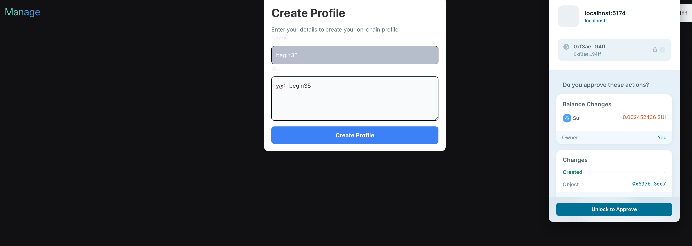
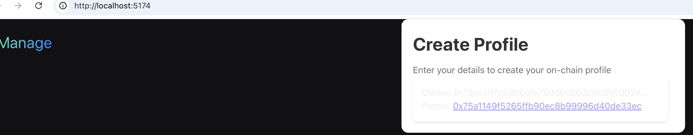
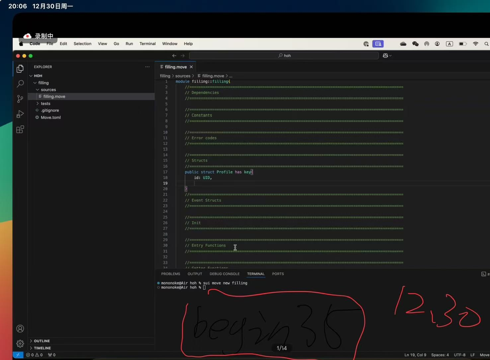
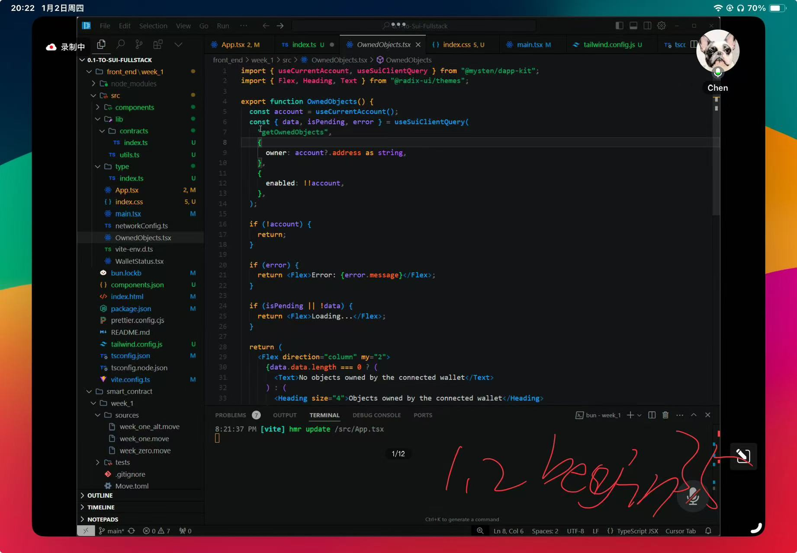
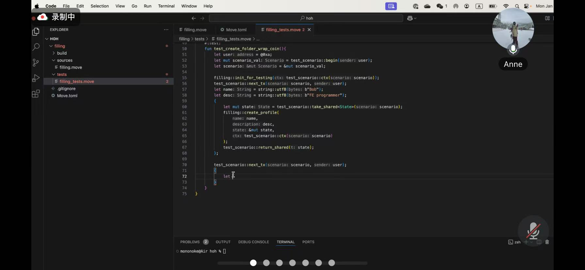
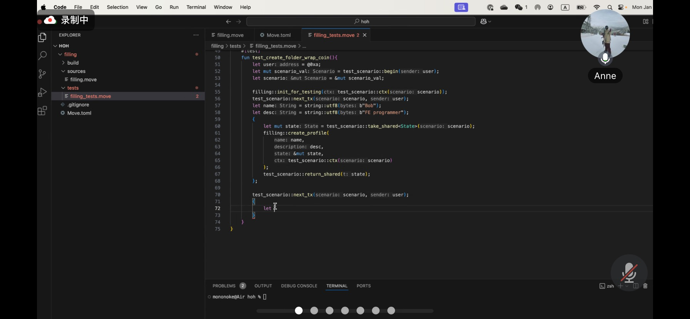
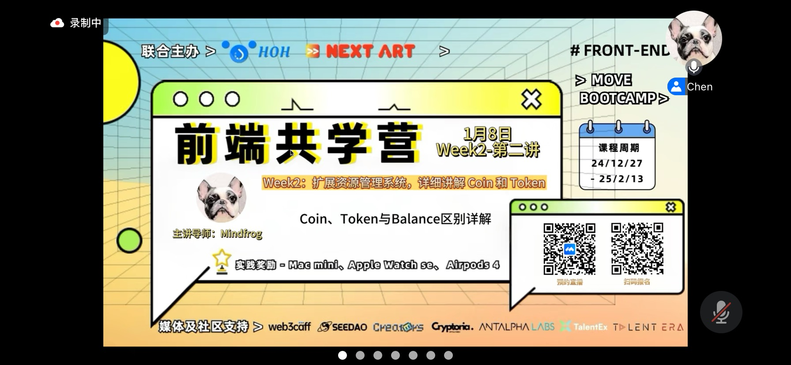
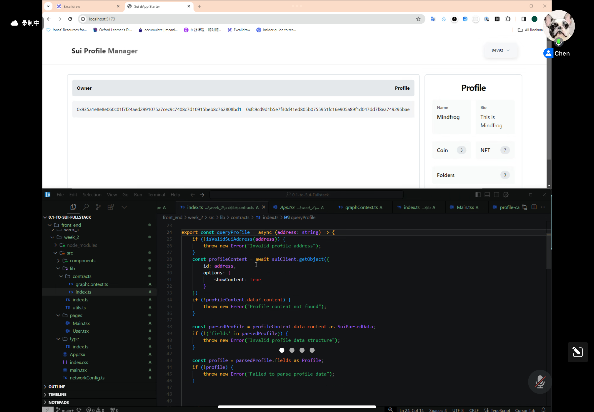
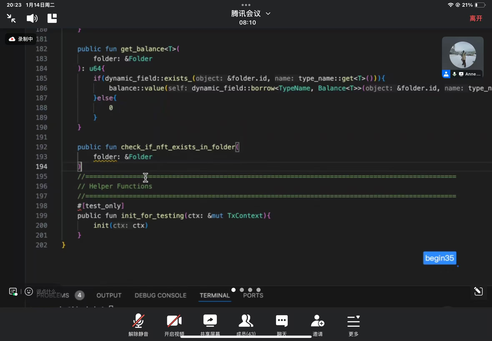

## 基本信息

- Sui 钱包地址: `0xf3ae297c88b60fa70dd8c860c8b595d02e56fd41074ace7aa93b9ba835b794ff`
  > 首次参与需要完成第一个任务注册好钱包地址才被合并，并且后续学习奖励会打入这个地址
- github: `janrone`

## 个人简介

- 工作经验: 10 年
- 技术栈: `Java` `TypeScript`
- 多年移动开发经验，对 Web3 ，Move 特别感兴趣，想通过 Move 入门区块链

## 作业

- [x] 第一周:

https://suiscan.xyz/testnet/object/0x75a1149f5265ffb90ec8b99996d40de33ec4de3be3acaea4db191da021b4d50c

- [] 第二周:

- [] 第三周:
- [] 第四周:

## b 站，推特关注

- [] b 站，推特关注截图: 

## 为共学营宣传（在朋友圈或者群聊中转发海报/文章）

- [] 宣传截图:

## 每周课程学习

- [] 第一周:
- [] 第二周:
- [] 第三周:
- [] 第四周:

## 参加直播答疑

- [x] 第一周:
      
      

- [x] 第二周:
      
      

- [x] 第三周:

- [] 第四周:

## 群里分享学习笔记

- [] 第一篇笔记
- [] 第二篇笔记
- [] 第三篇笔记
- [] 第四篇笔记

## 对外输出学习笔记

- [x] 第一篇笔记
      https://blog.csdn.net/janronehoo/article/details/145043355
- [x] 第二篇笔记
      https://blog.csdn.net/janronehoo/article/details/145043610
- [x] 第三篇笔记
      https://blog.csdn.net/janronehoo/article/details/145043743
- [x] 第四篇笔记
      https://blog.csdn.net/janronehoo/article/details/145044023
- [x] 第五篇笔记
      https://blog.csdn.net/janronehoo/article/details/145044171
- [x] 第六篇笔记
      https://blog.csdn.net/janronehoo/article/details/145044243
- [x] 第七篇笔记
      https://blog.csdn.net/janronehoo/article/details/145044593
- [x] 第八篇笔记
      https://blog.csdn.net/janronehoo/article/details/145092258

## 在 HOH 社区公众号发布自己的技术文章

- [] 第一篇笔记【公众号文章链接】
- [] 第二篇笔记【公众号文章链接】
- [] 第三篇笔记【公众号文章链接】
- [] 第四篇笔记【公众号文章链接】

## 直播分享学习技巧/工具推荐

- [] 会议截图:

## 提交项目

- [] 项目提交
