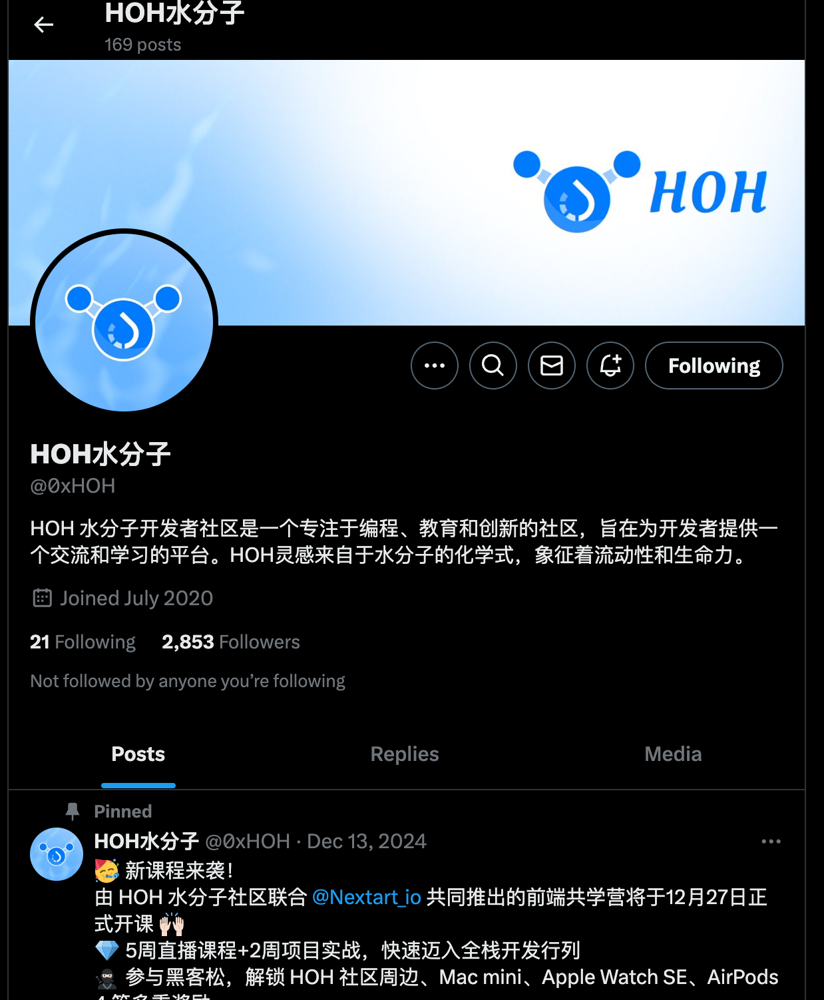

## 个人简介
- 工作经验: 13年
- 技术栈: `Rust` `TypeScirpt` `React` `NextJS`
- 拥有10年以上的前端开发经验，精通TypeScript和React，具备大型项目开发和前端架构优化的丰富经验。同时熟悉Rust语言，深入学习了Web3技术，能够在Solana区块链上进行开发。专注于技术创新与提升，具备快速解决复杂技术问题的能力。
- 联系方式: tg: `https://t.me/xiaxianlin`

## 作业
- [*] 第一周: https://sui.xiaxianlin.com/task
- [] 第二周:
- [] 第三周:
- [] 第四周:

## b站，推特关注

- [*] 推特关注截图: 
- [*] b站关注截图: 

## 为共学营宣传（在朋友圈或者群聊中转发海报/文章）

- [] 宣传截图:

## 每周课程学习

- [*] 第一周:
- [] 第二周:
- [] 第三周:
- [] 第四周:

## 参加直播答疑

- [] 第一周:
- [] 第二周:
- [] 第三周:
- [] 第四周:

## 群里分享学习笔记

- [] 第一篇笔记
- [] 第二篇笔记
- [] 第三篇笔记
- [] 第四篇笔记

## 对外输出学习笔记

- [] 第一篇笔记【学习笔记链接】
- [] 第二篇笔记【学习笔记链接】
- [] 第三篇笔记【学习笔记链接】
- [] 第四篇笔记【学习笔记链接】

## 在HOH社区公众号发布自己的技术文章

- [] 第一篇笔记【公众号文章链接】
- [] 第二篇笔记【公众号文章链接】
- [] 第三篇笔记【公众号文章链接】
- [] 第四篇笔记【公众号文章链接】

## 直播分享学习技巧/工具推荐

- [] 会议截图:

## 提交项目

- [] 项目提交

